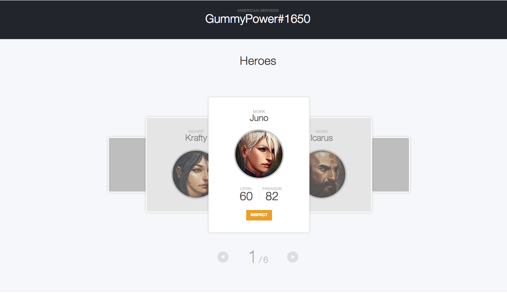

Diablo 3 Profile X
======================

An effort to improve the Diablo 3 profile browsing experience. [Try it now](http://htmlpreview.github.io/?https://github.com/k39chen/D3PX/blob/master/index.html)!

Features
------------

+ Simple and clean interface through which to digest profile information
+ Easy-to-use battletag search bar with a server/region dropdown (currently supports US/EU/KR/TW servers)
+ Displays D3 heroes in a carousel with name, level/paragon level, class, and hardcore information
+ Presents chart data on class preference by hero playtime and primary hero by career kills
+ Pays respect to Fallen Heroes and traces hardcore death history in a timeline
+ Tracks storyline progression in both softcore and hardcore modes

Usage
------------

To preview **Diablo 3 Profile X** [click here](http://htmlpreview.github.io/?https://github.com/k39chen/D3PX/blob/master/index.html) or 
simply download the ZIP through git and open the `index.html` in any browser (preferably Chrome).

Credits
-------------
Actively using the [Diablo 3 API](http://blizzard.github.io/d3-api-docs/) and inspired by the [original designs](http://us.battle.net/d3/en/profile/gummypower-1650/) of Diablo 3 profiles.

License
-------------
Copyright (c) 2013 Kevin Chen.

_______________
**Due to drastic changes to core gameplay in Diablo 3, features presented with this project will become irrelevant upon release of the expansion. As a result, development and support of this project will be discontinued.**
